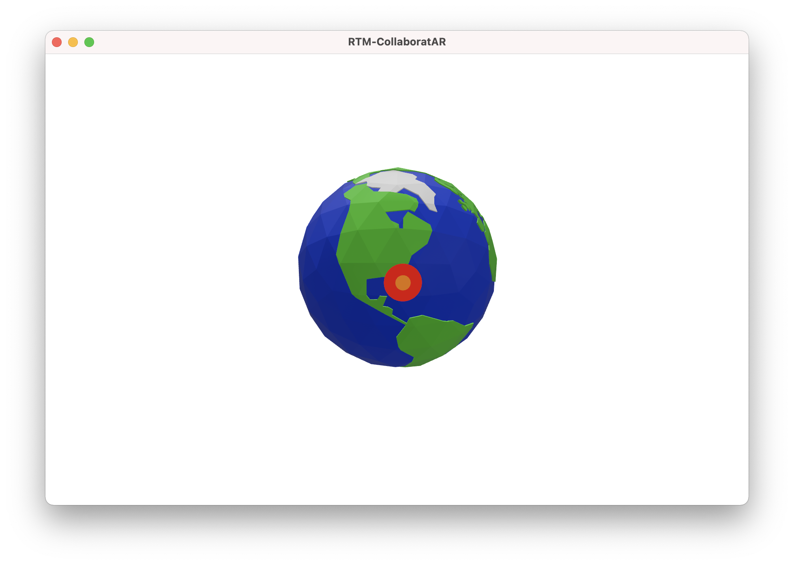

# Creating Collaborative AR Experiences with Agora

CollaboratAR is an iOS example project created by Agora to show some ways you can use Agora's SDKs to create an interactive experience in Augmented Reality. This post shows you how to connect the dots using Agora Real-time messaging, making the experience shareable between multiple people from anywhere in the world.

To see an overview of how the example works, check out this post:

<link to intro post>

And the full source code:

https://github.com/AgoraIO-Community/Collaborative-AR-RTM

## What is Agora Real-time Messaging (RTM)?

Agora Real-time Messaging is an SDK that lets you send data between devices that are connected to the network. These data could contain an encoded struct, plain text, or even larger files such ranging from PDFs to 3D files.

An example of some of the messages we will send across the network are our device location in the scene and details about the room we have created for others to be able to join it.

## How Real-time Messaging is Used in CollaboratAR

There are currently 6 different types of messages that will be sent across the network in CollaboratAR, they are stored in an enum to make it easy to tell them apart when sending and receiving:

```swift
enum RawRTMMessageDataType: String {
  
    // MARK: Globe Scene
  
    /// A session is available to display on the globe
    case channelAvailable
    /// Request all available sessions
    case getSessionData
  
    // MARK: Collaborative Session
  
    /// A model has been created or transform modified
    case singleCollabModel
    /// Multiple models are available to display in the scene
    case multiCollabModels
    /// A model has been deleted
    case removeCollabModel
    /// Transform update for a remote user
    case peerUpdate
}
```


### Globe Scene 🌎

#### Sending

In the initial scene there is a globe visible. If a remote user is currently in a channel or experience we see them on the globe as a red circle with an orange centre. 

First let's see how the presence of a channel is sent from the hosting device.

In our project, there are two methods called `sendCollabChannel` that have two different uses; one sends data to the channel, another sends it to a specific user. The channel-wide message is sent when a new experience is created, the message is sent to a specific user when a new user joins the globe "lobby".

The data sent across starts in the form of a struct called `ChannelData`, which contains a few key data:

```swift
struct ChannelData: Codable {
    var channelName: String
    var channelID: String
    var position: SIMD3<Float>
    var systemImage: String?
}
```

The `ChannelData` struct conforms to `Codable`, which makes sure we are able to encode all the data of our struct, and provides methods to easily do so.

To send this across the network, we need to create a message that can be sent across Agora's RTM network. The class for this message will be `AgoraRtmRawMessage`, to see the documentation for this class, see here:

https://docs.agora.io/en/Real-time-Messaging/API%20Reference/RTM_oc/Classes/AgoraRtmRawMessage.html?platform=iOS

Our data can be encoded with the swift [JSONEncoder](https://developer.apple.com/documentation/foundation/jsonencoder) as so:

```swift
// channelData: ChannelData
let jsonData: Data = try! JSONEncoder().encode(channelData)
```

> Force unwrap here should be handled gracefully

The `jsonData` object is of type [Data](https://developer.apple.com/documentation/foundation/data), which is ready to use in the creation of an [AgoraRtmRawMessage](https://docs.agora.io/en/Real-time-Messaging/API%20Reference/RTM_oc/Classes/AgoraRtmRawMessage.html?platform=iOS) instance. The second property when creating an [AgoraRtmRawMessage](https://docs.agora.io/en/Real-time-Messaging/API%20Reference/RTM_oc/Classes/AgoraRtmRawMessage.html?platform=iOS) is a description, which we will use to state the type of data in the message by the RawRTMMessageDataType's rawValue, which is a String.

We are sending a message of type `RawRTMMessageDataType.channelAvailable`, so our [AgoraRtmRawMessage](https://docs.agora.io/en/Real-time-Messaging/API%20Reference/RTM_oc/Classes/AgoraRtmRawMessage.html?platform=iOS) creation will look like this:

```swift
let channelDataRTM = AgoraRtmRawMessage(
  rawData: jsonData,
  description: RawRTMMessageDataType.channelAvailable.rawValue
)
```

And to send that to our lobby channel, which is used for the Globe scene, we can do just this:

```swift
// rtmChannel: AgoraRtmChannel
rtmChannel.send(channelDataRTM)
```

#### Receiving

Now that our message has been sent across the network, we now need to use the Agora RTM Delegate methods to catch the incoming messages, and interpret them as channels available to join.

As this message is sent across the channel, we need to use the AgoraRtmChannelDelegate to catch that, as well as the AgoraRtmDelegate for when messages are sent directly to users.

The same message may either be sent channel-wide or directly to a user, so instead of handling them individually we can pass these through one set of logic in another method, `handleIncomingMessage`, like so:

```swift
extension <Class Example>: AgoraRtmDelegate, AgoraRtmChannelDelegate {
  func channel(
    _ channel: AgoraRtmChannel,
    messageReceived message: AgoraRtmMessage,
    from member: AgoraRtmMember
  ) {
    handleIncomingMessage(message, channel: channel, from: member)
  }

  func rtmKit(
    _ kit: AgoraRtmKit, messageReceived message: AgoraRtmMessage,
    fromPeer peerId: String
  ) {
    handleIncomingMessage(message)
  }

  fileprivate func handleIncomingMessage(
    _ message: AgoraRtmMessage,
    channel: AgoraRtmChannel? = nil,
    from member: AgoraRtmMember? = nil
  ) {
    // Handle messages
  }
}
```

In the project on GitHub there is a big switch case that handles all the different messages, but we will initially only talk about the `channelAvailable` type we are interested in.

First, to determine the type of message, we can create an instance of `RawRTMMessageDataType` using the rawValue initialiser inside the handleIncomingMessage function:

```swift
let messageType = RawRTMMessageDataType(rawValue: message.text)
```

Then, if our messageType is `.channelAvailable`, we can decode the message back into a ChannelData type:

```swift
if messageType == .channelAvailable {
  let channelData = try! JSONDecoder().decode(ChannelData.self, from: rawMessage.rawData)
  // show channel data on globe...
}
```

In our example project, there is a method to take a `ChannelData` object and spawn a point on the globe, called `spawnHitpoint`. `spawnHitpoint` takes the data stored inside `ChannelData` to set the position of the target, and the behaviour when clicked.

The `ChannelData` object contains the unique channelID to join for both the Real-time messaging channel and the Audio channel. Read on see how that is joined and what happens when joining the collaboration scene.

#### Globe Scene Conclusion

That's all the data that needs to be sent across Agora RTM network in the inital globe scene. All each device needs to know is what available channels there are and where to place them on the globe. There are no audio channels joined when in the lobby, that comes in the next section.

### Collaboration Scene

A lot more data are sent around in the collaboration scene, including positions of all the other users, any models they add, move, delete, and also the data interpreted from the Audio channel they are all members of.

The first step is joining the scene. This is triggered by a call to a method called `setState`, which contains an enum of the following type:

```swift
enum CollaborationState {
  case globe
  case collab(data: ChannelData)
}
```

We will just cover the `collab` case, leaving `globe` empty in the snippets:

```swift
switch collabState {
case .globe:
  // handle joining globe scene
  break
case .collab(let collabData):
  // the following two lines handle the creation of entities
  // that are not shared across the network
  self.tearDownGlobe()
  self.launchCollabScene()

  // Enable local microphone, then join Audio channel
  self.rtcKit.enableLocalAudio(true)
  self.rtcKit.joinChannel(
    byToken: AppKeys.appToken, channelId: collabData.channelID,
    info: nil, uid: self.rtcID ?? 0
  ) { chname, uid, _ in
     self.rtcID = uid
     self.updatePositions()
  }

  // Create + Join RTM Channel using collabData
  self.channels.collab = self.rtmKit.createChannel(
    withId: collabData.channelID, delegate: CollaboratARDelegateEntity.shared
  )
  self.channels.collab?.join(
    completion: { joinResponse in
      if joinResponse != .channelErrorOk {
        print("could not join collabs channel: \(joinResponse.rawValue)")
      }
      CollaboratARDelegateEntity.shared.joinedCollabChannel(
        self.channels.collab!
      )
    }
  )
}
```

In the above snippet, rtcKit is our `AgoraRtcEngineKit` instance for joining the Audio channel, and rtmKit is our `AgoraRtmKit` for joining the Real-time messaging channels.

The Audio channel ID is taken from `collabData.channelID`, the same as our Real-time messaging channel. These can be different, but they are the same strings in this project example. The token handling for Audio and RTM are not covered in this post or the example project, please use a development project that does not require a token, or generate the token from a token server.

Once we have joined the RTM channel, the designated host of the channel will send information about all the objects that are currently in the scene to the new joiner.

To do so, we use the `AgoraRtmChannelDelegate` method, memberJoined. From here we check that the new member's channelId is different from "lobby" (the globe channel), and if we have been in the channel longer than anyone else, we gather all the data about entities in the scene and send that to the newest member.

The data shared will be an array of type `[ModelData]`, which is defined here:

```swift
struct ModelData: Codable {
    /// Unique ID for this model
    var id: String
    /// Name of the USDZ file to use
    var usdz: String
    /// Scale of the entity
    var scale: SIMD3<Float>
    /// Orientation of the entity
    var rotation: simd_float4
    /// Position of the entity
    var translation: SIMD3<Float>
    /// Full Transform of the entity based on the scale, rotation and translation
    var transform: Transform {
      Transform(
        scale: scale, rotation: simd_quatf(vector: rotation),
        translation: translation
      )
    }
    /// Last user to move this entity
    var owner: String
    init(id: String, usdz: String, transform: Transform, owner: String? = nil) {
        self.id = id
        self.usdz = usdz
        self.scale = transform.scale
        self.rotation = transform.rotation.vector
        self.translation = transform.translation
        self.owner = owner ?? CollaborationExpEntity.shared.rtmID
    }
}
```

#### Sending All Models

All the entities we want to share conform to a custom protocol `HasCollabModel`, and are children of an entity we have a reference to called `collabBase`.

```swift
guard let collabChildren = collabBase.children.compactMap{
  $0 as? HasCollabModel
} else { return }
let allModelData: [ModelData] = collabChildren.map { $0.modelData }
```

The struct `ModelData` conforms to Codable, which means that it, and an array of `ModelData` can be encoded with JSON as easily as seen earlier with `ChannelData`, and then sent to our user the same way:

```swift
// member: AgoraRtmMember
let jsonData = try! JSONEncoder().encode(allModelData)
let rawMessge = AgoraRtmRawMessage(
  rawData: jsonData,
  description: RawRTMMessageDataType.multiCollabModels.rawValue
)
self.rtmKit.send(rawMessge, toPeer: member.userId)
```

#### Receiving All Models

On the other end, the device that just joined the channel needs to receive these models and place them in the scene.

We already have the RawRTMMessageDataType as shown in the globe scene, we need to add a case to `handleIncomingMessage` to catch when our messageType is `.multiCollabModels`, and then go on to add a model to the scene:

```swift
if messageType == .multiCollabModels {
  let modelDatas = try! JSONDecoder().decode([ModelData].self, from: rawMessage.rawData)
  CollaborationExpEntity.shared.collab?.update(with: modelDatas)
}
```

Let's take a look at what the `update` method does:

```swift
func update(with models: [ModelData]) {
  for modelData in models {
    if let child = self.findEntity(named: modelData.id) as? CollabModel {
      child.update(with: modelData)
    } else {
      self.createModelEntity(with: modelData)
    }
  }
}
```

First it checks if an entity with the same ID already exists in the scene. If it does, then the CollabModel entity transform is updated with a very short animation. Otherwise a new CollabModel is created based on the data contained inside `ModelData`:

```swift
func createModelEntity(with modelData: ModelData) {
  let collabMod = CollabModel(with: modelData)
  self.collabBase.addChild(collabMod)
}
```

#### Updating User Positions

All the remote AR users will have their location relative to the ground square sent to the channel, so that all the other users know where they are in the world. The called method is `CollaborationExpEntity.updatePositions`, and it is called on an interval of 0.3 seconds after you have joined a channel and set the ground square. The 0.3 seconds value is arbitrary, and can be altered if a faster update is desired.

The type of object sent over in this is of a custom struct, PeerData:

```swift
struct PeerData: Codable {
  var rtmID: String
  var rtcID: UInt?
  var usdz: String?
  var scale: SIMD3<Float>
  var rotation: simd_float4
  var translation: SIMD3<Float>
  var colorVector: [CGFloat]
  var color: Material.Color {
    Material.Color(
      red: self.colorVector[0], green: self.colorVector[1],
      blue: self.colorVector[2], alpha: self.colorVector[3]
    )
  }
  var transform: Transform {
    Transform(
      scale: scale, rotation: simd_quatf(vector: rotation),
      translation: translation
    )
  }
}
```

The color and transform properties are created by using the other properties, because `Material.Color` and `Transform` do not conform to `Codable` themselves. The above struct contains all the data needed to distinguish between the different remote users.

##### Sending User Position

In the `updatePositions` method, we first get the cameraTransform, and then get that transform relative to the collabBase, which is the entity set when joining the collab session.

If we are running on an iOS device, and not the simulator, we proceed to create a PeerData object, get the channel instance, and send our raw message with the description showing that it is of `.peerUpdate` type.

```swift
extension CollaborationExpEntity {
  @objc func updatePositions() {
    if let camTransform = self.arView?.cameraTransform,
    let localisedCam = self.collab?.collabBase.convert(
      transform: camTransform, from: nil
    ) {
      // Check that we are on iOS, and the cameraMode is .ar
      #if os(iOS) && !targetEnvironment(simulator)
      if self.arView?.cameraMode == .ar {
        // Create PeerData Codable object
        let peerData = PeerData(
          rtmID: self.rtmID, rtcID: self.rtcID, usdz: nil,
          scale: .one,
          rotation: localisedCam.rotation.vector,
          translation: localisedCam.translation,
          colorVector: self.assignedColor
        )
        // Encode PeerData
        let jsonData = try! JSONEncoder().encode(peerData)
        let rawMessage = AgoraRtmRawMessage(
          rawData: jsonData,
          description: RawRTMMessageDataType.peerUpdate.rawValue
        )
        // Send positional data to the entire channel
        self.channels.collab?.send(rawMessage)
      }
      #endif
    }
  }
}
```

##### Receiving User Position

Very similarly to recieving all the model updates in the previous example, we catch the case when our messageType is `.peerUpdate`, decode it, and send it to a collaboration update function.

```swift
if messageType == .peerUpdate {
  let peerData = try! JSONDecoder().decode(
    PeerData.self, from: rawMessage.rawData
  )
  CollaborationExpEntity.shared.collab?.update(with: peerData)
}
```

Inside the update function, we either create a new `PeerEntity`, or update the transform of the existing one:

```swift
func update(with peerData: PeerData) {
  if let child = self.findEntity(named: peerData.rtmID) as? PeerEntity {
    child.update(with: peerData)
  } else {
    self.createPeerEntity(with: peerData)
  }
}
```

#### Updating a Model

A similar update to `.multiCollabModels` is `.singleCollabModel`. This update is sent almost exactly the same way as `.multiCollabModels`, only that it is a single model rather than an array.

We send this update instantly on creation of a model, and periodically if a model is selected and ready to be moved around the scene.

When joining the scene, a scheduled timer is initially fired to execute the function `updatePositions()`, which sends user location every 0.3 seconds (but could be faster if required). When a model is selected, updatePositions sees that `selectedBox` is not null so triggers a function, `sendCollabData`, which sends its position as an update to the channel:

```swift
func sendCollabData(for collabEnt: HasCollabModel) {
  let jsonData = try! JSONEncoder().encode(collabEnt.modelData)
  let rawMessge = AgoraRtmRawMessage(
    rawData: jsonData,
    description: RawRTMMessageDataType.singleCollabModel.rawValue
  )
  self.channels.collab?.send(rawMessge)
}
```

And is then received by `handleIncomingMessage` on the other end, and calls the same method as with `.multiCollabModels`:

```swift
if messageType == .singleCollabModel {
  let modelData = try! JSONDecoder().decode(ModelData.self, from: rawMessage.rawData)
  CollaborationExpEntity.shared.collab?.update(with: [modelData])
}
```

#### Deleting an Entity

When deleting an entity, the enum `.removeCollabModel` is used, and the individual model data is sent with the following message:

```swift
// model: CollabModel, collabChannel: AgoraRtmChannel
let jsonData = try! JSONEncoder().encode(model.modelData)
let rawMessge = AgoraRtmRawMessage(
    rawData: jsonData,
    description: RawRTMMessageDataType.removeCollabModel.rawValue
)
collabChannel.send(rawMessge)
```

And on receiving, it finds the model in the scene, then removes it from parent:

```swift
if messageType == .removeCollabModel {
  let modelData = try! JSONDecoder().decode(ModelData.self, from: rawMessage.rawData)
  if let foundEntity = CollaborationExpEntity.shared.collab?.findEntity(
    named: modelData.id
  ) {
    // Found the entity we want to delete, remove it from the scene
    foundEntity.removeFromParent()
  }
}
```

## Testing

All of the above methods can be found in the full example project:

https://github.com/AgoraIO-Community/Collaborative-AR-RTM

Some of the methods contain additional code to aid the rest of the experience. The above explanations are focusing mainly on using Agora Real-time Messaging SDK to enable the remote collaboration.

If anything is unclear, please feel free to send me a [message on twitter](https://twitter.com/maxxfrazer).

## Conclusion

I hope you've enjoyed this post and the project that comes along with it. The idea of this project is to showcase how Agora Real-time Messaging can be used to create interactive experiences with people around the world.
