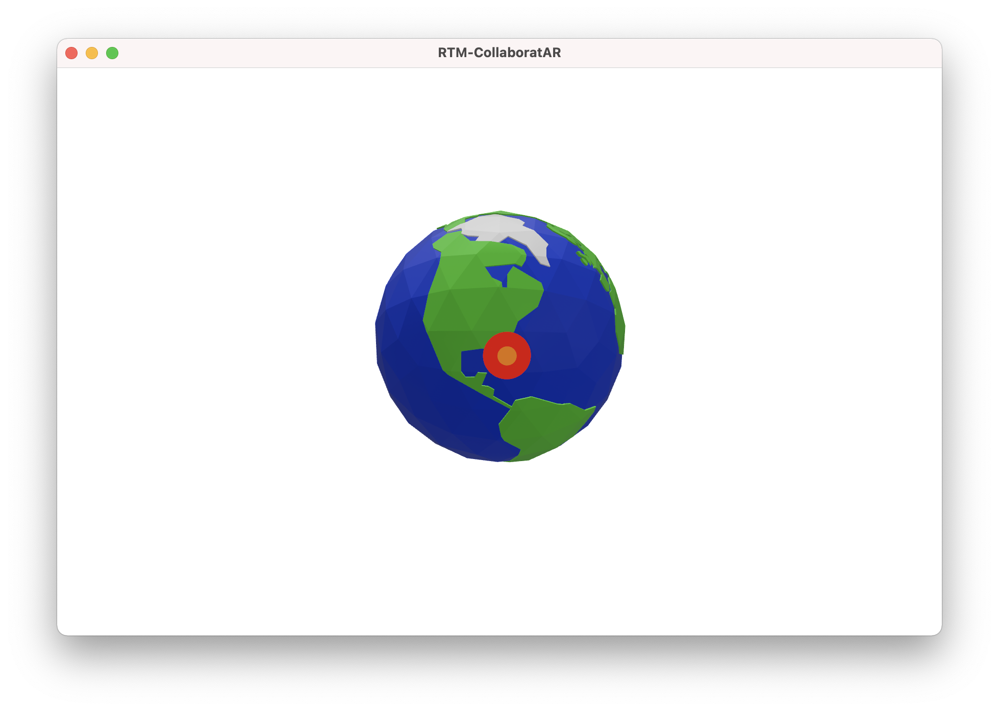

# Multi-User Collaborative iOS AR Experiences with Agora

Agora is much more than a video streaming SDK. One other SDK available from Agora is the Real-time Messaging SDK.

The Real-time messaging SDK can be used to send chunks of data across the network, including encoded structs, files, or plain text.

CollaboratAR is an example project where people can either join an active session or create a new one, located at a place of their choosing on a 3D earth floating in front of them. Once joined, users can add, modify, and remove objects from the scene, with updates being sent to everyone else in the channel.

When joining a session, the users also join an Audio channel using Agora Audio SDK, so they can see each other's location as well as hearing them speaking.

This is what the session might look like from the macOS view, which does not have Augmented Reality:

## App Flow

On first launching the app the user is instructed to find a horizontal surface where the globe will spawn from. After finding a good horizontal surface the earth spawns and any active channels will appear on the globe in the form of a red/orange circular target.

The user has the option to either select one of these targets to join a current room, or to create a new room by selecting elsewhere on the globe model.

After joining a channel, the following things will happen:

- The user will join an audio channel and can hear all other users who have their microphones connected.
- A collection of models appear at the bottom that the user can place in the scene.
- The locations of all remote users in the form of a transluscent sphere and a visible microphone if their microphone is on.
- Any models that have already been placed into the scene will appear in the place set by other users.

The user can tap on their model of choice then on the scene to place it anywhere they like. Any placements of objects will be immediately shared with everyone else in the channel at the relevant location of the scene for them.

A user can select a model to delete, scale, rotate or move it around the scene. These updates are sent across the network, and on receiving the update the local session will animate the object from the old transform to the new one.

## Technologies Used

- Agora Real-time Messaging SDK

- Agora Audio SDK

- RealityKit

## How It Works

To see how this works, you can check out our in depth blog on how each part interacts with Agora Real-time Messaging SDK as well as Agora Audio SDK:

<link to blog>

The full source code is available here:

https://github.com/AgoraIO-Community/Collaborative-AR-RTM

## What You Could Do With This

Using the techniques outlined in here you could create experiences for people to share ideas in AR or VR, as well as with a 2D experience. Anything that someone does on their own device anywhere in the world could easily be represented in another user's experience using Agora Real-time messaging.

The same techniques could be used to make a multiplayer game, live interactive support, or something more basic like a live chat feature.

## Other Resources <a name="other-resources"/>

For more information about building applications using Agora Video and Audio Streaming SDKs, take a look at the [Agora Video Call Quickstart Guide](https://docs.agora.io/en/Video/start_call_ios?platform=iOS&utm_source=medium&utm_medium=blog&utm_campaign=swiftpm) and [Agora API Reference](https://docs.agora.io/en/Video/API%20Reference/oc/docs/headers/Agora-Objective-C-API-Overview.html?utm_source=medium&utm_medium=blog&utm_campaign=swiftpm).

I also invite you to join the [Agora Developer Slack community](https://www.agora.io/en/join-slack/).

